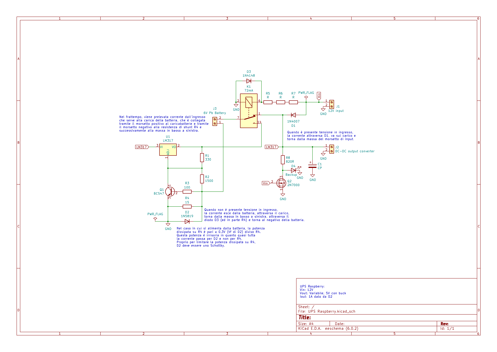

# Raspberry-USB-UPS
Simple DC UPS circuit for every kind of device!

## You must read me!
This circuit is far from being perfect, but it works like a charm with my Raspberry Pi 3B!
Here are some notes about the circuit:
- You must attach a dissipator to the `LM317` because when the Pb battery is discharged, it will limit the current by dissipating power through himself.
- I also used a little fan because I chose a very little dissipator for space reasons.
- You can set the charging voltage as usual (classical `LM317` formulas).
- You can set the maximum charging current by the formula *R4/Vbe*, where the `Vbe` of `Q1` is typically between **0.6V** and **0.7V**.
- You can use every type of DC converter at the output (Buck, Boost ecce cc...) to fix the voltage, it's up to your needs; you can also check my [THT-BuckConverter](https://github.com/LoZioo/THT-BuckConverter "A full THT Buck converted based on the popular LM2596 IC").
- The output max current is given by the two diodes: you can choose for `D2` every Schottky diode you like with a high max current and power dissipation and whatever you want for `D1` (just make sure it won't burn out due to excessive power dissipation).

## Schematics

